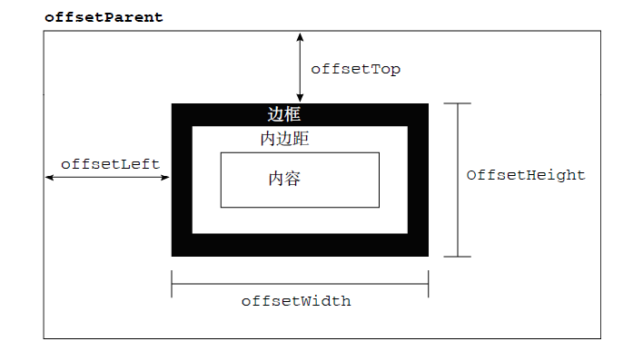
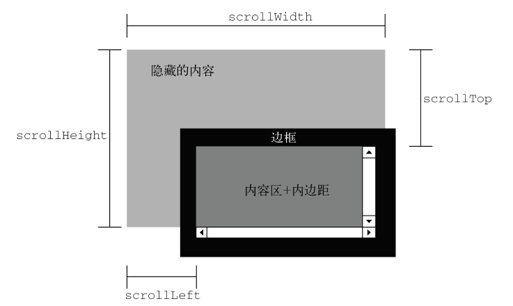
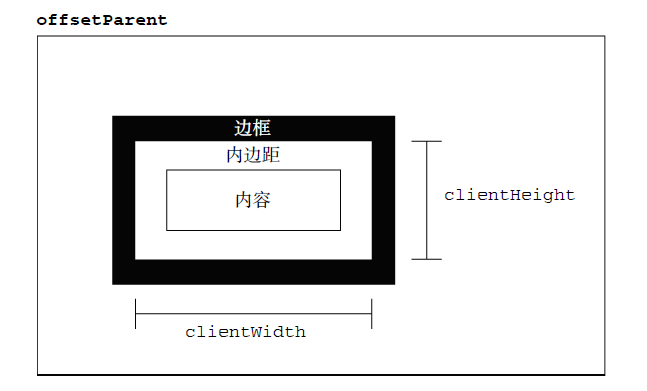

# 前端知识点

## 综合性问题
### 1、[vue双向绑定的原理](https://segmentfault.com/a/1190000006599500)
> Vue通过数据劫持和发布者/订阅者模式来实现双向数据绑定，通过Object.defineProperty()对象方法来劫持属性的访问描述符，在getter中进行订阅，在setter中进行发布。
### 2、[Vue生命周期](https://segmentfault.com/a/1190000008010666)
### 3、[虚拟DOM的原理](http://www.jianshu.com/p/ec4a1b7d37dd)
### 4、[gulp与webpack的区别](http://www.cnblogs.com/lovesong/p/6413546.html)
>- gulp/grunt是一种构建工具，能够优化前端的工作流程，比如自动刷新页面,压缩css、js、图片,编译sass等等。简单来说，就是使用Gulp/Grunt，然后配置你需要的任务，就可以把以前需要手工做的事情让它它自动进行。
>- seajs/requirejs：是一种在线"编译"模块的方案，相当于在页面上加载一个 CMD/AMD 解释器。这样浏览器就认识了 define、exports、module这些东西，也就实现了模块化。
>- browserify/webpack：是一个预编译模块的方案，相比于上面，这个方案更加智能。没用过browserify，这里以webpack为例。首先，它是预编译的，不需要在浏览器中加载解释器。另外，你在本地直接写JS，不管是 AMD/CMD/ES6风格的模块化，它都能认识，并且编译成浏览器认识的JS。
### 4、[promise的原理](https://zhuanlan.zhihu.com/p/25178630)
### 6、[前端页面渲染机制](http://blog.codingplayboy.com/2017/03/29/webpage_render/#DOM)
### 7、[viewport详解](https://github.com/ant-design/ant-design-mobile/wiki/viewport%E8%AF%A6%E8%A7%A3)
### 8、[块格式上下文BFC](https://juejin.im/post/5909db2fda2f60005d2093db)
>1. BFC的触发条件
  >>* 根元素，即HTML元素
  >>* float非none
  >>* overflow非visible
  >>* position为absolute、fixed
  >>* display为inline-block、table-cell、table-caption、flex
>2. BFC的布局规则
  >* 内部的box在垂直方向上排列
  >* 垂直间距由margin决定，相邻margin会重叠
  >* BFC区域不会被float元素重叠
  >* BFC就是页面上的一个隔离的独立容器，容器里面的子元素不会影响到外面的元素。反之也如此
  >* 计算高度时会把float元素计算在内
>3. 作用
  >>* 自适应两栏布局
  >>* 阻止元素被浮动元素覆盖
  >>* 包含浮动元素
  >>* 阻止外边距合并
### 9、XSS与CSRF
>- [XSS:跨站脚本攻击](http://mp.weixin.qq.com/s/6ChuUdOm7vej8vQ3dbC8fw)
>> 攻击者通过一些手段，将一些恶意内容，比如js脚本，插入到受攻击的网站，用户使用浏览器进行访问时就会受到攻击。分为三种类型：
>>>1. 存储型XSS：数据库中存有的存在XSS攻击的数据，返回给客户端。若数据未经过任何转义，被浏览器渲染。就可能导致XSS攻击
>>>2. 反射型XSS：将用户输入的存在XSS攻击的数据，发送给后台，后台并未对数据进行存储，也未经过任何过滤，直接返回给客户端，被浏览器渲染，就可能导致XSS攻击
>>>3. DOM-XSS：纯粹发生在客户端的XSS攻击

>> 防御举措
>>> 对输入输出进行过滤和转义
>- [CSRF:跨站请求伪造](https://www.qcloud.com/community/article/279687?fromSource=gwzcw.107201.107201.107201)
>> 攻击者盗用了受害者的身份，以受害者的名义发送请求，受害者必须依次完成两个步骤才会遭受攻击：
>>>1. 登录受信任网站A，并在本地存储了cookie
>>>2. 在不登出A的情况下，访问危险网站B

>> 防御举措：
>>>- referer白名单
>>>- 请求中携带token
### 10、不支持冒泡的事件
>* mouseenter、mouseleave
>* load、unload
>* focus、blur
>* error
>* abort（中断，图片记载中断，请求发送中断等）
>* resize
### 11、前端SEO注意事项
>1. 合理设置title、description、keywords，三者的权重递减
>2. 语义化HTML，符合W3C规范
>3. 重要的内容放在最前面
>4. 少用iframe
>5. 非装饰性图片添加alt属性
>6. 提高网站的响应速度
### 12、浏览器内核与对应前缀
| 浏览器| 内核|前缀|
| --------|--------|--------|
| Chrome| WebKit |-webkit-|
| Safari|WebKit|-webkit-|
| IE|Trident|-ms-|
| FireFox|Gecko|-moz-|
| Opera|Presto|-o-|
### 13、[浏览器常见的兼容性问题](https://juejin.im/post/59a3f2fe6fb9a0249471cbb4?utm_source=gold_browser_extension)
### 14、从浏览器地址栏输入url到显示页面的步骤
>1. 在浏览器中输入url并回车
>2. 浏览器查看该url对应的缓存是否存在，存在的话检查是否过期（命中强缓存），没有过期的话直接从缓存中读取
>3. 浏览器解析url，提取出协议、主机、端口号、资源路径等
>4. 构造HTTP请求(请求行、请求头、请求体)
  >>* 请求行：请求方法（GET），请求URI(path)，协议版本(HTTP/1.1)，CRLF
  >>* 请求头：Host: *.*.com、If-Modified-Since: *、Cache-Control: max-age=0、Cookie: authorstyle=yes、Referer: https://www.google.com.hk/ ...
  >>* 请求体：name=qiu&age=25，GET请求体为空
>5. 查询主机IP地址，查找顺序如下：
  >>* 浏览器缓存
  >>* 本地缓存
  >>* host文件
  >>* 路由器缓存
  >>* 运营商DNS服务器
  >>* 二级域名DNS服务器
  >>* 顶级域名DNS服务器
>6. 与目标IP地址建立TCP链接（三次握手）
  >>* 客户端向服务器端发送SYN握手信号
  >>* 服务器返回ACK确认信号与SYN握手信号
  >>* 客户端发送ACK确认信号 
>7. 发送HTTP请求
>8. 服务器解析请求，检查是否命中协商缓存,命中则返回304状态码
>9. 构造HTTP响应（状态行、相应头、响应体）
  >>* 状态行：HTTP版本，状态码，状态描述，CRLF
  >>* 响应头：Last-Modified:*、Cache-Control: max-age=21600、Content-Type: text/html; charset=iso-8859-1 ...
  >>* 响应体：HTML文件内容
>10. 发送HTTP响应
>11. 根据情况关闭TCP链接，或保留
  >>* 主动方发送FIN关闭链接信号
  >>* 被动方发送ACK确认信号
  >>* 被动方发送FIN关闭链接信号
  >>* 主动方发送ACK确认信号
>12. 浏览器检查状态码200、304
>13. 缓存资源
>14. 解析HTML文档（自上而下解析）
>15. 构建DOM树(文档内所有节点构成的一个树形结构)
>16. 构建CSSOM树（与DOM树结构相似，只是另外为每一个节点关联了样式信息）
>15. 根据DOM树和CSSOM树构建渲染树（每一个渲染对象都对应着DOM节点，但是非视觉（隐藏，不占位）DOM元素不会插入渲染树）
>17. 布局（layout）
>18. 绘制（paint）
>19. 显示页面
### 15、网站性能优化
>1. 减少http请求：合并CSS、JS文件，CSS Sprites，小图转化为base64格式
>2. 减少dom层级
>3. CSS放在head中
>4. JS放在body尾部
>5. 开启缓存：强缓存（Cache=Control、Expires）与协商缓存（Last-Modified/if-modified-since、Etags/if-none-match）
>6. 启用gzip压缩
>7. 压缩图片、JS文件、CSS文件
>8. CDN
>9. 减少dom的访问
>10. 不使用CSS表达式与@import
>11. 样式结构层次尽量简单
### 16、什么是渐进增强
在web设计时强调可访问性、语义化HTML标签，保证所有人都能访问页面的基本内容和功能，同时为高级浏览器用户提供更好的用户体验。
>* 所有浏览器都能访问基本内容
>* 所有浏览器都能使用基本功能
>* 语义化HTML标签
>* 通过外部样式增强页面布局
>* 通过外部脚本增强页面功能
### 17、HTML语义化及好处
通过包含语义的标签恰当的表示页面的结构，即使在没有样式的情况下页面也能恰当的展示
>* 页面结构清晰
>* 利于SEO
>* 便于盲人阅读
>* 没有样式也能够恰当展示
### 17、HTTP状态码及含义
>* 1XX：服务器端已接收到请求，但需要客户端的进一步操作
>* 2XX：服务器成功接收并处理了请求
>* 3XX：需要进一步操作以完成请求
  >>* 301：请求的资源被永久地转移到了新的URI，返回信息会包括新的URI，浏览器会自动定向到新URI。今后任何新的请求都应使用新的URI代替
  >>* 302：请求的资源被临时的转移到了新的URI，客户端应继续使用原有URI
  >>* 304：请求的资源没有修改，服务器不会返回资源，客户端使用缓存资源
>* 4XX：客户端错误，请求包含错误的语法或无法完成请求
  >>* 404：请求的资源无法找到
>* 5XX：服务器错误，服务器在处理请求的过程中发生了错误
### 18、ES6新特性
>* 块作用域（let、const）
>* class、extends
>* 箭头函数
>* 模块
>* promise
### 19、手写一个ajax请求
```javascript
var request = new XMLHttpRequest(); // 新建XMLHttpRequest对象
//var request = new ActiveXObject('Microsoft.XMLHTTP'); // 新建Microsoft.XMLHTTP对象

request.onreadystatechange = function () { // 状态发生变化时，函数被回调
    if (request.readyState === 4) { // 成功完成
        // 判断响应结果:
        if (request.status === 200) {
            // 成功，通过responseText拿到响应的文本:
            return success(request.responseText);
        } else {
            // 失败，根据响应码判断失败原因:
            return fail(request.status);
        }
    } else {
        // HTTP请求还在继续...
    }
}

// 发送请求:
request.open('GET', '/api/categories');
request.send();
```
### 20、ajax readyState
>* 0：请求未初始化
>* 1：服务器连接已建立
>* 2：正在发送请求
>* 3：正在接受服务器响应
>* 4：接受服务器响应完毕
## HTML相关问题
### 1、块级元素与行内元素
- 常见的块级元素
> div、p、form、h1~h6、ul、ol、li、dl（定义列表）、dt（列表中的项目）、dd（项目的描述）
- 常见的行内元素
> span、a、b、img、input、select、lable、textarea
- 块级元素的特点
>- 垂直方向排列
>- 独占一行，宽度自动填充父容器宽度
>- 可设置宽高及内外边距
>- 可容纳其他块级元素与行内元素
- 行内元素的特点
>- 水平方向排列
>- 宽度由内容决定，高度由字体大小决定
>- 无法设置宽高及水平外边距
>- 可容纳文本及其他行内元素
- 行内元素如何转为块级元素
>- float: left、right
>- position: absolute、fixed
>- display: block
### 2、语义化HTML标签
使用语义化的HTML标签包裹内容，例如导航使用nav，侧边栏使用aside，顶部和尾部使用header/footer，页面比较独立的部分可以使用article，如用户的评论。
> 好处：
>>- 使文档结构清晰，便于组织和维护
>>- 即使在没有样式的情况下也能够友好显示
>>- 利于搜索引擎理解，便于SEO
>>- 方便盲人阅读
## CSS相关问题
### 1、[三栏布局](https://zhuanlan.zhihu.com/p/25070186?refer=learncoding)
### 2、padding的取值单位有哪些，当为百分比时是如何取值的
#### height的百分比取值相对于父元素的content height
#### width、padding、margin的百分比取值相对于父元素的content width
#### top、bottom的百分比取值相对于父元素的padding（height）+content（height）
#### left、right的百分比取值相对于父元素的padding（width）+content（width）
>* px
>* em（相对于父元素字体大小，如果该元素设置了字体大小，则相对于该元素字体大小）
>* rem（相对于根元素字体大小）
>* vh （相对于视窗的高度）
>* vw （相对于视窗的宽度）
>* vmin（vh、vw的较小者）
>* vmax（vh、vw的较大者）
>* %
### 3、清除浮动的常用方式
>1. BFC
>2. 伪元素
```javascript
.clearfix:before,
.clearfix:after {
    content: " "; /* 1 */
    display: table; /* 2 */
}

.clearfix:after {
    clear: both;
}
```
>3. 容器元素闭合标签前添加额外元素并设置clear: both
### 4、CSS可以继承的属性
>- 文字排版相关
  >>- font
  >>- text-align（文本对其方式）
  >>- text-indent（首行文本缩进）
  >>- white-space（指定元素内的空白如何处理）
  >>- word-break（规定自动换行的处理方法）
  >>- word-wrap（允许长单词或 URL 地址换行到下一行）
  >>- ...
>- line-height(行高，值为%时基于当前字体尺寸的百分比)
>- color
>- visibility
>- cursor（鼠标悬停在元素上时显示的光标）
### 5、z-index不起作用怎么办
- 原因
>- 问题一：元素是非定位元素，z-index属性作用于定位元素之上（position:relative、absolute、fixed）
>- 问题二：z-index的拼爹性质，父元素的z-index小于其兄弟元素的z-index，导致子元素无论设置多大的z-index都不生效
- 解决方案
>- 问题一：将元素设置成定位元素
>- 问题二：去掉父元素的z-index属性
### 6、[offsetTop/offsetLeft/offsetWidth/offsetHeight/offsetParent](http://www.cnblogs.com/xiaohuochai/p/5828369.html)
偏移量(offset dimension)是javascript中的一个重要的概念。涉及到偏移量的主要是offsetLeft、offsetTop、offsetHeight、offsetWidth这四个属性。偏移参照定位父级offsetParent。

>>- offsetParent：与元素最近的定位（position非static）父元素
>>>1. 元素自身有fixed定位，offsetParent的结果为null
>>>2. 元素自身无fixed定位，且父级元素都未经过定位，offsetParent的结果为  &lt;body&gt;
>>>3. 元素自身无fixed定位，且父级元素存在经过定位的元素，offsetParent的结果为离自身元素最近的经过定位的父级元素
>>>4. body元素的offsetParent是null
>>- offsetWidth =  border-left-width + padding-left + width + padding-right + border-right-width + 垂直滚动条宽度; 
>>- offsetHeight =  border-top-width + padding-top + height + padding-bottom + border-bottom-width + 水平滚动条高度;
>>- offsetTop： 元素的上外边框至offsetParent元素的上内边框之间的像素距离
>>- offsetLeft：元素的左外边框至offsetParent元素的左内边框之间的像素距离
### 7、scrollTop/scrollLeft/scrollWidth/scrollHeight

>>- scrollHeight：在没有滚动条的情况下，元素内容的总高度
>>- scrollWidth：在没有滚动条的情况下，元素内容的总宽度
>>- scrollLeft：被隐藏在内容区域左侧的像素数，通过设置这个属性可以改变元素的滚动位置
>>- scrollTop：被隐藏在内容区域上方的像素数，通过设置这个属性可以改变元素的滚动位置
### 8、clientTop/clientLeft/clientWidth/clientHeight
>>- clientLeft: 元素的内边距的外边缘和边框的外边缘的距离，实际就是左边框的宽度
>>- clientTop：元素上边框高度
>>- clientWidth：元素内容区的宽度+左右内边距的宽度，不包括外边距、边框、垂直滚动条的高度
>>- clientHeight：元素内容区的高度+上下内边距的高度，不包括外边距、边框、水平滚动条的高度
### 9、getClientRects()/getBoundingClientRect()
### 10、[clientHeight , scrollHeight , offsetHeight之间的区别及兼容方案](http://www.cnblogs.com/nanshanlaoyao/p/5964730.html)

## JS相关问题
### 1、原型链属性遮蔽
>* 如果一个普通的名为foo的数据访问属性在[[Prototype]]链的高层某处被找到，而且没有被标记为只读（writable:false），那么一个名为foo的新属性就直接添加到 myObject上，形成一个遮蔽属性。
>* 如果一个foo在[[Prototype]]链的高层某处被找到，但是它被标记为只读（writable:false），那么设置既存属性和在myObject上创建遮蔽属性都是不允许的。如果代码运行在strict mode下，一个错误会被抛出。否则，这个设置属性值的操作会被无声地忽略。不论怎样，没有发生遮蔽。
>* 如果一个foo在[[Prototype]]链的高层某处被找到，而且它是一个setter，那么这个setter总是被调用。没有foo会被添加到（也就是遮蔽在）myObject上，这个foo setter也不会被重定义。
### 2、函数节流与函数防抖
>1. 函数节流：指定时间间隔内只会执行一次函数（强调首次触发执行的间隔）
```javascript
function throttle(fn, interval) {
  var canRun = true;
  return function () {
    if (canRun) {
      canRun = false;
      fn.apply(this, arguments);
      setTimeout(function () {
        canRun = true;
      }, interval);
    }
  }
}
```
>2. 函数防抖：频繁任务触发的情况下,任务触发的时间间隔超过一定时间才会执行（强调最后一次触发到执行的间隔）
```javascript
function debounce(fn, interval) {
  var timer = null;
  return function () {
    if (timer) {
      clearTimeout(timer);
    } else {
      timer = setTimeout(() => {
        fn.apply(this, arguments);
      }, interval);
    }
  }
}
```